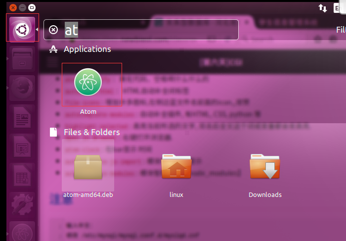
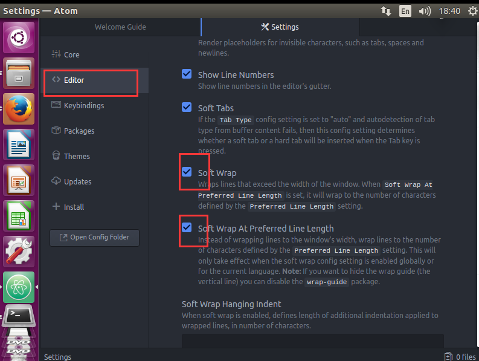
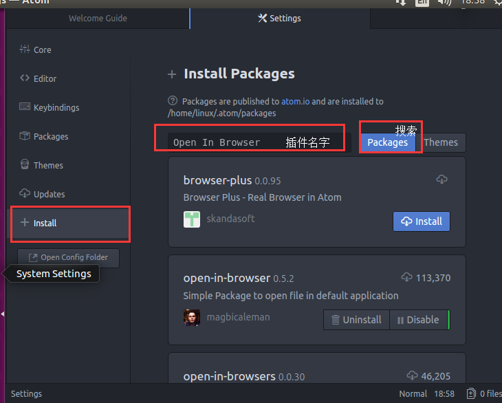

# atom的安装及使用
## 下载安装包
1. 首先进入[atom.io](https://atom.io/)下载安装包.   
2. 点击如下红框内进入github里面atom的下载地址  
  
3. 然后右键Downloads下面atom-amd64.deb（deb为ubuntu安装包的后缀）    
  

4. 选择复制下载链接（若在ubuntu系统内，也可以直接下载）   
  
5. 然后在ubuntu系统内使用wget -c 下载地址 下载  
>wget -c https://github.com/atom/atom/releases/download/v1.18.0/atom-amd64.deb  

其中-c表示断点续传

## 安装atom
> sudo dpkg -i atom-amd-64.deb  
其中dpkg为安装后的deb包的意思，-i为install的缩写
安装完成后如下图搜索点击后就会打开atom
 
## 设置atom
点击edit ->references 进入如下界面，选择红框红色的选项，勾选即可  
  

## 安装插件
选择红框红色的选项，在搜索框里面填写插件名字，点击搜索在install即可。  
  

#### Atom editor 开环境使用的插件  
* activate-power-mode：动感插件 atl + ctrl + o :打开插件  
* vim-mode：vim模式  
* ex-mode：实现:w功能  
* monokai：高亮显示  
* atom-ternjs：JavaScript 自动补全  
* autoprefixer：给 CSS 添加适当的前缀  
* color-picker：选颜色    
* emmet：写 HTML 的神器  
* atom-beautify：美化代码，空格啊什么什么的  
* autoclose-html：HTML自动补全闭标签  
* file-icons: 增加许多图标,在侧边蓝文件名前面的icon,,很赞  
* autocomplete-modules: 自动补全插件, 有HTML, CSS, python 等  
* highlight-selected: 高亮当前所选的文字, 双击后全文这个词或变量都会变高亮.  
* Open In Browser: 右键打开浏览器.  
* atom-clock: 在bar显示 时间  
* autocomplete-js-import: 模块导入智能提示  
* autocomplete-modules: 模块智能提示【node_modules】  

### atom的使用
在需要打开的目录下输入
> atom .  

就会在atom里面打开
