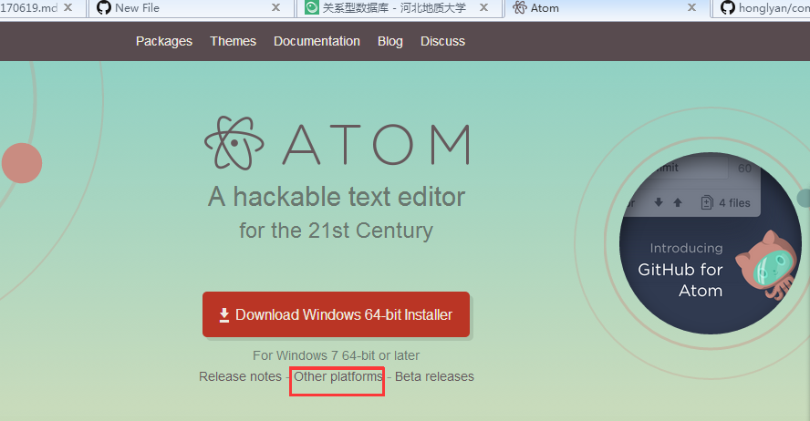
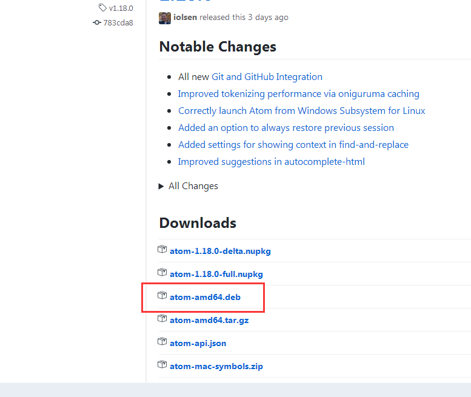
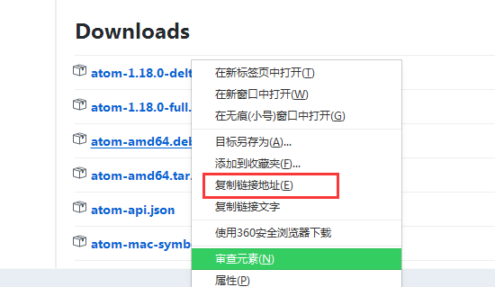

# atom的安装及使用
## 1.下载安装包
首先进入[atom.io](https://atom.io/)下载安装包.   
点击如下红框内进入github里面atom的下载地址  
  
然后右键Downloads下面atom-amd64.deb（deb为ubuntu安装包的后缀）    
  

选择复制下载链接（若在ubuntu系统内，也可以直接下载）   
  
然后在ubuntu系统内使用wget -c 下载地址 下载  
>wget -c https://github.com/atom/atom/releases/download/v1.18.0/atom-amd64.deb  

其中-c表示断点续传

